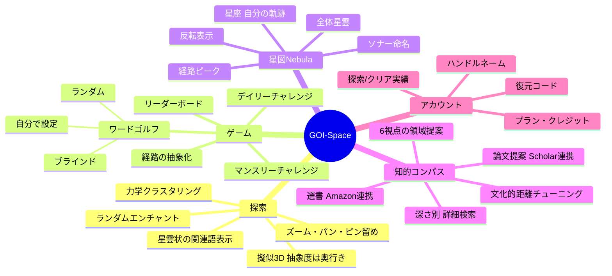
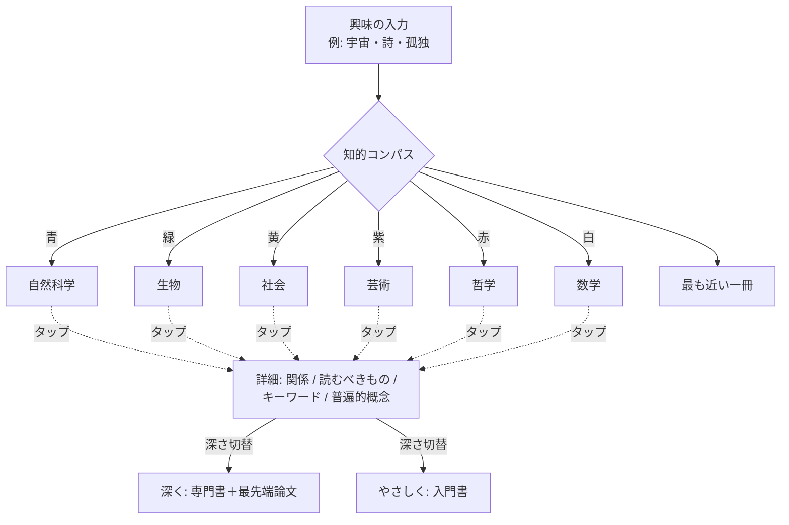
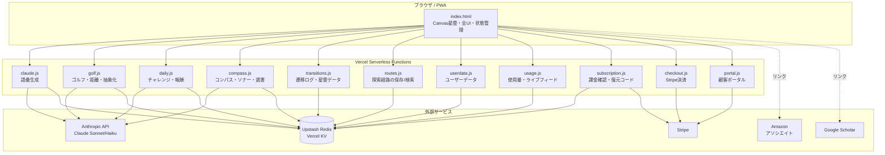
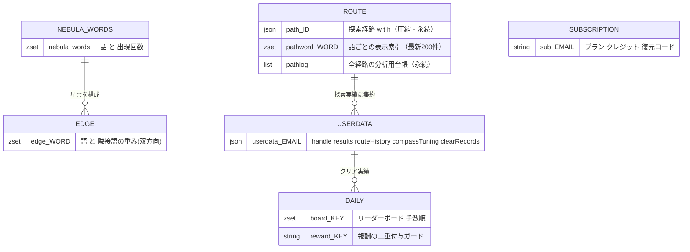
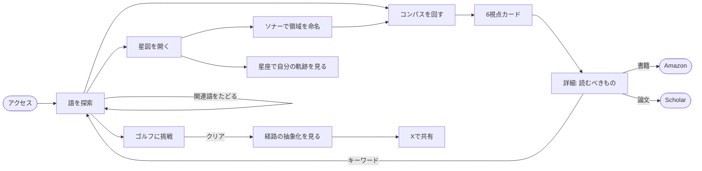
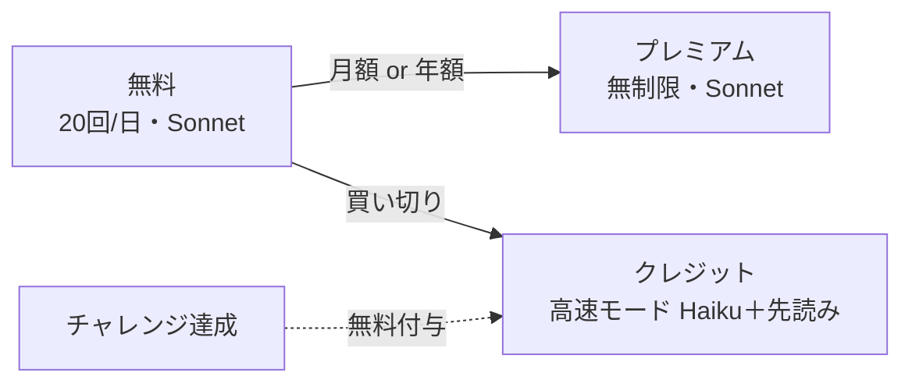

# 語彙空間 — GOI-Space

**言葉を入力すると、関連語が星雲のように広がる語彙探索アプリ。**
探索・ゲーム・知的コンパスを通じて、言葉と概念のつながりを旅する体験を提供します。

🌐 [https://goispace.app](https://goispace.app)

---

## 目次

- [コンセプト](#コンセプト)
- [機能マップ](#機能マップ)
- [主要機能](#主要機能)
- [システム構成（アーキテクチャ）](#システム構成アーキテクチャ)
- [データモデル](#データモデル)
- [ユーザー体験フロー](#ユーザー体験フロー)
- [課金・権限モデル](#課金権限モデル)
- [技術スタック](#技術スタック)
- [デプロイ](#デプロイ)

---

## コンセプト

言葉は孤立して存在しない。ある語は無数の語とつながり、意味の網の目を織りなしている。
GOI-Space は、その網の目を **星雲（Nebula）** として可視化し、ユーザーが自らの手で言葉の宇宙を旅するためのツールである。

3つの体験軸で構成される：

| 軸 | 体験 | 問い |
|----|------|------|
| **探索** | 語から関連語へ、自由に広がる | 「この言葉の周りには何があるか？」 |
| **ゲーム** | 語と語を最短でつなぐ | 「AとBはどうつながるか？」 |
| **コンパス** | 自分の興味から遠い知へ導かれる | 「自分がまだ知らない領域はどこか？」 |

---

## 機能マップ



---

## 主要機能

### 1. 語彙探索（Explore）

言葉を入力すると、関連語がキャンバス上に星雲状に広がる。

- **意味カテゴリで色分け**：類義・対義・上位/下位・比喩・コンテキスト
- **擬似3D表示**：つながりの多い抽象的な語ほど「奥」に、具体的な語ほど「手前」に配置（奥ほど小さく暗い）
- **力学クラスタリング**：よく一緒に辿られる語が引き合い、自然に意味の星団を形成
- **操作**：ホイール/ピンチでズーム、ドラッグでパン、右クリックでピン留め、ダブルクリックで外部検索
- **ランダムエンチャント**：無関係な語を投入し、意外な文脈を発見

### 2. ワードゴルフ（Golf）

スタート語からゴール語へ、関連語をたどって最少手数で到達するゲーム。

- **3モード**：ランダム / 自分で設定 / ブラインド（ゴールが隠れ、距離の温度だけが頼り）
- **逐次距離測定**：語を選ぶたびにゴールとの意味的距離を測定・保存
- **経路の抽象化**：クリア時、「AとBを繋いだもの」をAIが読み解く（例：孤独と宇宙を繋いだもの＝内省の拡張）
- **グレード**：イーグル/バーディー/パー/ボギー（パー基準）

### 3. デイリー / マンスリーチャレンジ

- 日替わり・月替わりの固定お題（全員共通）
- クリアで無料クレジット付与
- 問題ごとのリーダーボード（手数順）

### 4. 星図（Nebula）モード

全ユーザーの探索を集約した「集合知の星雲」を旅する独立ビュー。

| サブ機能 | 内容 |
|----------|------|
| **星雲** | 全体の語ネットワークを表示。明るい星ほど多くの人が辿った語 |
| **経路** | ある語を辿った人々の道筋が星図上に光る。語が発光し波紋が広がる |
| **ソナー** | 何もない空間を長押しすると円が広がり、囲んだ語群から共通の意味を抽出・命名 |
| **反転** | 明暗・大小を逆転。埋もれたマイナーな語を浮かび上がらせる |
| **星座** | 自分が探索した語だけを輝かせ、辿った軌跡を線で結ぶ「自分の思考の地図」 |

### 5. 知的コンパス（Compass）★中核機能

自分の興味を入力すると、そこから**文化的に離れた6つの学問領域**を指し示す。



- **文化的距離チューニング**：6分野ごとに「近い（易しい）↔遠い（難解）」を調整、アカウントに保存
- **深さ別詳細**：カードをタップ → やさしく/標準/深くで内容を変更
  - 「深く」では入門書ではなく**理解を深める本＋最先端論文**（論文はGoogle Scholarへ）
- **選書連携**：書籍はAmazonアソシエイト、キーワードはタップで探索へ
- **ソナー連携**：ソナーで命名した領域をそのままコンパスで探れる

### 6. 藍の夢（出藍の誉）

目標から「未踏の知の航海図」を紡ぐ機能。集合知（藍）から出発した探索が、集合知を超えた場所へ到達するためのもの。

- **入力**：知りたいゴール（例：YouTube再生数を伸ばしたい）
- **処理**：①先駆者確認（追走の地図／開拓の地図）→ ②必要な知の領域を8〜12個展開 → ③二重の未踏検出（本人未踏＝学習価値／集合知未踏／人類未踏候補＝学術価値）→ ④依存関係順のA4一枚の航海図に凝縮
- **二層構造**：表層は一望できる航海図。各項目の**註脚**を開くと前提知識・核心・文献・キーワードが深く展開（遅延生成・全体キャッシュ）
- **誠実な限界表示**：人類未踏候補にはAIの**未検証の予測**と調査計画のみを提示し、「研究が必要」と明示。研究成果の捏造はしない
- **コスト**：15クレジット（チャレンジ達成でも入手可能）
- **全件公開・永続保存**：文化資本による知のアクセス格差を再生産しないため。誰かの航海図は次の誰かの出発点になる

### 7. SEOロングテールページ（検索流入の自動化）

`/word/孤独` のような各語の静的ページを自動生成し、Google検索からの流入を得る仕組み。

- 「〇〇 類語」「〇〇 関連語」で検索する層を、宣伝なしで継続的に取り込む
- **ハイブリッド生成**：初回アクセスでHTMLを生成 → Redisに7日キャッシュ。以降はキャッシュを返すのでAI・DBコストは1語1回のみ
- **関連語データ**：星雲データ（実際の共起）を優先し、不足分をAI（Haiku）で補完
- 各ページは相互リンク（類語チップが別の `/word/` へ）することで、内部リンク網とクロール効率を高める
- `sitemap.xml` を自動生成（星雲の頻出語＋生成済みページ）、`robots.txt` から通知
- canonical・OGP・JSON-LD（schema.org DefinedTerm）を完備
- ページ内のCTAから `/?q=語` でアプリの探索へ誘導

---

## システム構成（アーキテクチャ）



**設計方針**：APIキーはサーバー側の環境変数に隠蔽。フロントは単一の `index.html`（Canvas描画＋全状態管理）。Vercel Hobby の関数数上限（12）に収まるよう、関連APIは統合（例：`usage.js` にライブフィード、`subscription.js` にクレジット照会）。

---

## データモデル

Redis（Upstash）に格納される主要なキー構造。



**クライアント側の状態**（`localStorage` ＋ アカウント同期）：

- `routeHistory` — 自由探索の経路（星座・実績の元データ）
- `clearRecords` — チャレンジのクリア実績（探索とは別管理）
- `compassTuning` — コンパスの文化的距離設定
- `dailyResults` — 日次/月次パズルの成績

---

## ユーザー体験フロー



言葉を探索し、ゲームで遊び、集合知の星図を覗き、自分の興味の外側へコンパスで導かれる——各機能は独立しつつ相互に接続し、探索の螺旋を描く。

---

## 課金・権限モデル



| プラン | 内容 |
|--------|------|
| **無料** | 1日20回の探索、標準モデル |
| **プレミアム**（¥500/月 or ¥5,000/年） | 無制限の探索 |
| **クレジット**（買い切り） | 高速モード（Haiku）＋クリック先読み。チャレンジ達成で無料付与 |

- 認証はメール不要の**復元コード方式**（GOI-XXXX-XXXX）。新端末での復元時のみ使用
- Stripe Checkout / Customer Portal で決済・解約・支払い管理

---

## 技術スタック

| 領域 | 技術 |
|------|------|
| フロントエンド | 素の HTML / CSS / JavaScript（Canvas API）、PWA対応 |
| バックエンド | Vercel Serverless Functions（Node.js） |
| AI | Anthropic Claude（Sonnet：品質重視、Haiku：高速・低コスト） |
| データベース | Upstash Redis（Vercel KV） |
| 決済 | Stripe |
| 収益化 | Google AdSense、Amazonアソシエイト |
| ホスティング | Vercel ＋ Cloudflare（独自ドメイン） |

**ファイル構成**：

```
goi-space/
├── api/                    Serverless Functions
│   ├── claude.js           語彙生成（キャッシュ・レートリミット）
│   ├── golf.js             ゴルフ（ペア生成・距離測定・経路抽象化）
│   ├── daily.js            デイリー/マンスリー（お題・報酬・ランキング）
│   ├── compass.js          知的コンパス・ソナー・選書詳細
│   ├── transitions.js      遷移ログ・星雲データ
│   ├── routes.js           探索経路の保存/検索
│   ├── userdata.js         ユーザーデータ（実績・設定）
│   ├── usage.js            使用量・ライブ検索フィード
│   ├── subscription.js     課金確認・クレジット・復元コード
│   ├── checkout.js         Stripe決済セッション
│   ├── portal.js           Stripe顧客ポータル
│   ├── _redis.js           Redis接続ヘルパー
│   ├── _ratelimit.js       レートリミッター
│   └── _wordpool.js        ゴルフお題の語プール
├── public/
│   ├── index.html          メインアプリ（全UI・Canvas・状態管理）
│   ├── privacy.html        プライバシーポリシー
│   ├── manifest.json       PWA設定
│   └── ...                 アイコン・OG画像・ads.txt
├── vercel.json
└── README.md
```

---

## デプロイ

### 前提

- GitHub アカウント / Vercel アカウント
- Anthropic APIキー（[console.anthropic.com](https://console.anthropic.com/settings/keys)）

### 手順

1. **GitHub** にリポジトリを作成し、このフォルダの中身をアップロード
2. **Vercel** で「Add New → Project」→ リポジトリをインポート
3. **環境変数**を設定（下表）
4. **Storage → Create Database → Upstash for Redis** を接続（`KV_REST_API_*` が自動追加される）
5. **Deploy**

### 環境変数

| 変数 | 用途 | 設定元 |
|------|------|--------|
| `ANTHROPIC_API_KEY` | Claude API | 手動 |
| `KV_REST_API_URL` / `KV_REST_API_TOKEN` | Redis | Vercel KV連携で自動 |
| `STRIPE_SECRET_KEY` | Stripe | 手動 |
| `STRIPE_PRICE_MONTHLY` / `STRIPE_PRICE_YEARLY` | 定期課金の価格ID | 手動 |
| `STRIPE_PRICE_CREDITS_*` | クレジットパックの価格ID | 手動 |
| `SITE_URL` | リダイレクト先 | 手動 |

> **注意**：Vercel Hobby はサーバー関数の上限が12。`api/` 直下で `_` 始まりでないファイル数がこれを超えないこと。

### 収益化の設定

- **AdSense**：`index.html` の `<head>` に発行スクリプトを設置、`public/ads.txt` を配置
- **Amazonアソシエイト**：`index.html` 冒頭の `window.AMAZON_TAG` にアソシエイトIDを設定
- フッターとプライバシーポリシーにアソシエイト表記を記載済み

---

## 更新履歴

全アップデートの一覧は [PATCHNOTES.md](PATCHNOTES.md) を参照。

---

## ライセンス / お問い合わせ

個人プロジェクト。お問い合わせは [privacy.html](public/privacy.html) 記載の連絡先まで。
